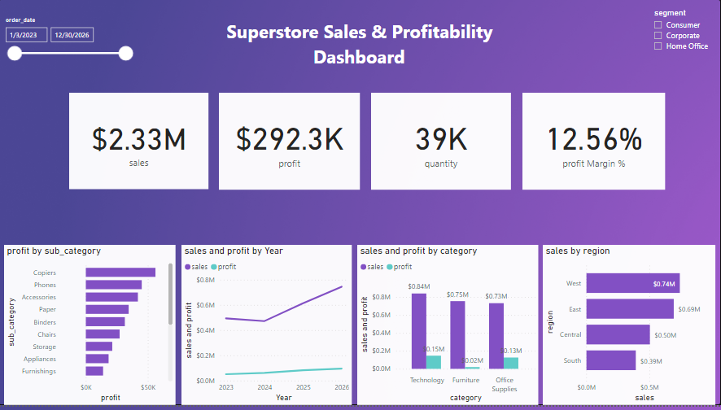

# Superstore E-Commerce Profitability & EDA Analysis
Exploratory Data Analysis and Data Visualization for Superstore E-Commerce profitability using Python

[](https://colab.research.google.com/drive/1onsz6orcr5tgNh8sIsjuigTgPNEjjGID?usp=sharing)

## 🔗 Live Notebook Link
You can view and run the full notebook interactively on Google Colab:
[Open Superstore Analysis in Google Colab](https://colab.research.google.com/drive/1onsz6orcr5tgNh8sIsjuigTgPNEjjGID?usp=sharing)

## 📌 Project Overview
An end-to-end data analysis project exploring over 10,000 transaction records to identify profit drivers, analyze regional performance, and evaluate discounting strategies.
---

## 📊 Power BI Executive Dashboard



### 📊 Key Performance Indicators (KPIs)
* **Total Sales:** $2.33M
* **Total Profit:** $292.3K
* **Quantity Sold:** 39K units
* **Profit Margin %:** 12.56%

### 💡 Key Dashboard Insights
1. **Profitability Driver:** **Technology** leads overall category net profit ($0.15M profit on $0.84M sales), with top-performing sub-categories being **Copiers** and **Phones**.
2. **Margin Drag Alert:** **Furniture** brings in strong sales revenue ($0.75M) but yields extremely low net profitability ($0.02M), indicating heavy discounting or high fulfillment costs across items like Tables and Bookcases.
3. **Regional Distribution:** The **West** region generates the highest revenue volume ($0.74M), followed closely by the **East** region ($0.69M).
4. **Temporal Growth:** Annual sales trends show steady top-line expansion from 2023 through 2026, maintaining healthy profit margins over time.

---

## 🛠️ Data Modeling & DAX Measures
Custom DAX measures were implemented in Power BI for dynamic analysis across date ranges and customer segments:

```dax
Profit Margin % = DIVIDE(SUM(cleaned_data[profit]), SUM(cleaned_data[sales]), 0)
